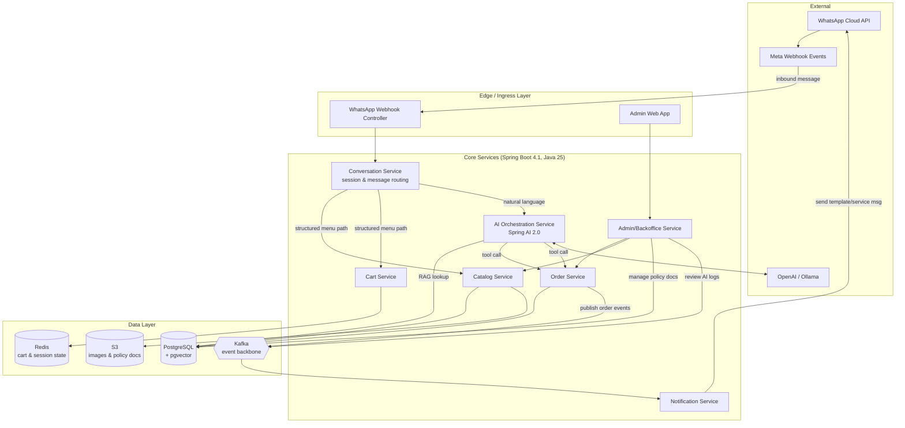
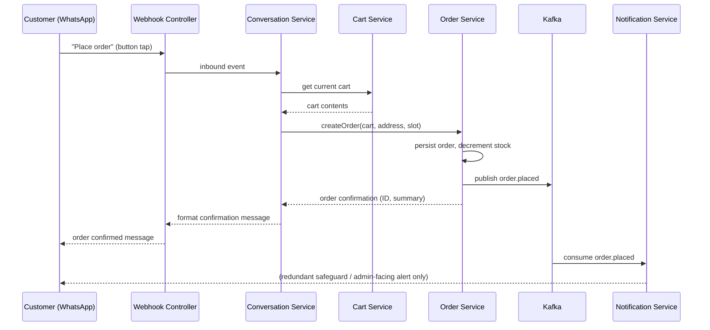
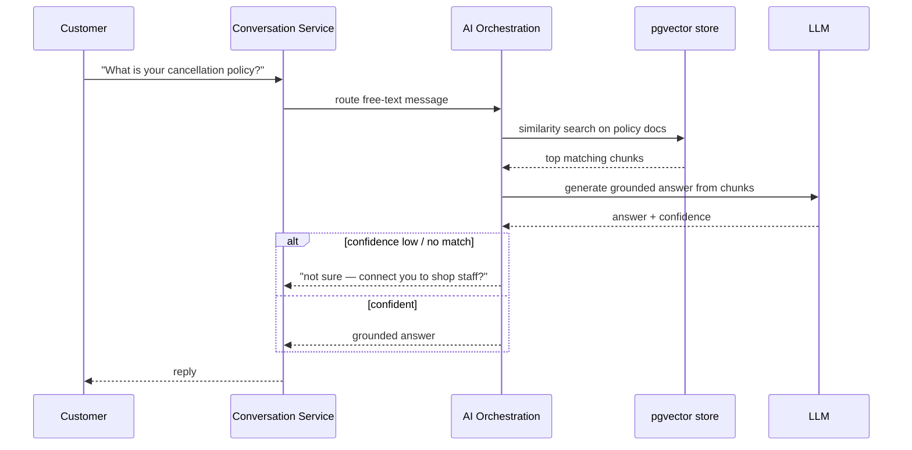
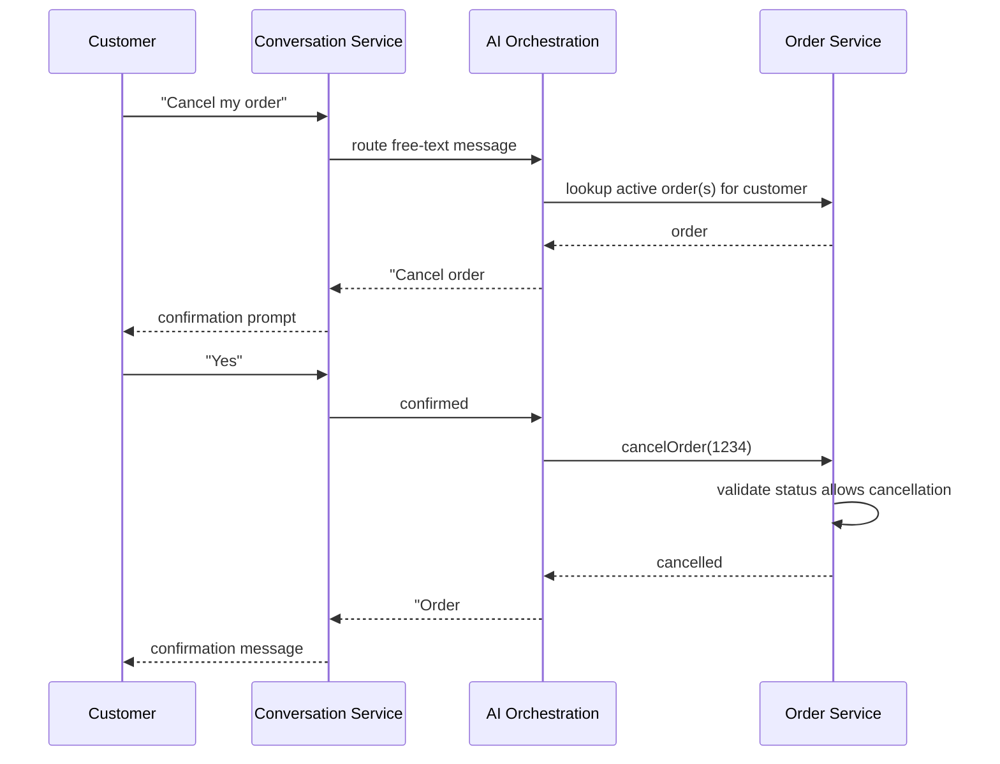
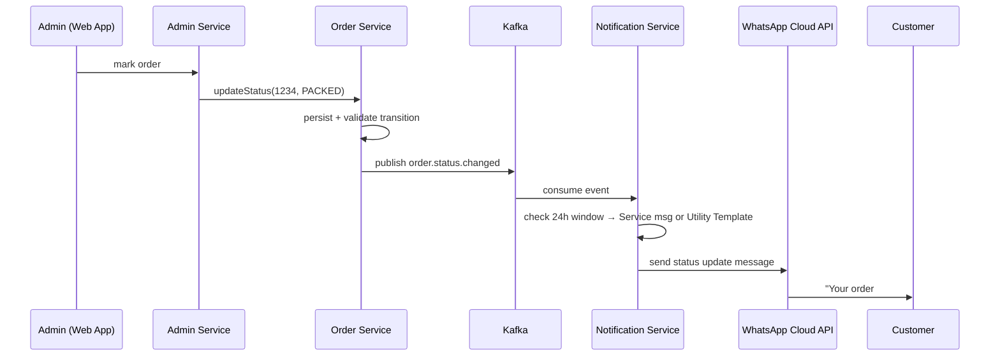
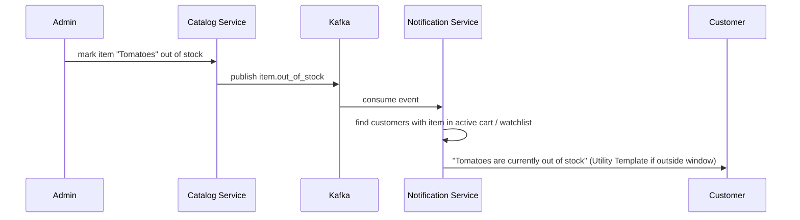

# WhatsApp Grocery Ordering System — Complete Architecture

## 1. Architecture Principles

1. **WhatsApp is a channel, not the source of truth.** All catalog, cart, order, and customer data lives in your own Postgres — WhatsApp is just where messages arrive and leave from.
2. **AI classifies and retrieves; it never executes.** Every state-changing action (cancel order, place order) goes through the same deterministic Order Service API whether triggered by a button, a menu, or an AI-parsed intent.
3. **Async by default.** Nothing that talks to WhatsApp's API or an LLM sits in the critical path of a customer's request-response cycle longer than necessary — Kafka absorbs the latency.
4. **One system serves three actors** (Customer via WhatsApp, Admin/Staff via web app, AI as an internal service) — not three separate systems bolted together.

---

## 2. High-Level Component Diagram



---

## 3. Component Responsibilities

### 3.1 WhatsApp Webhook Controller (Edge)
- Validates Meta's webhook signature.
- Deserializes inbound message payload (text, button reply, list reply).
- Immediately hands off to Conversation Service and returns HTTP 200 — no synchronous processing here (WhatsApp expects a fast ack).

### 3.2 Conversation Service
- Owns session state per phone number (current screen/menu, active cart reference) — backed by Redis.
- Routes each inbound message: structured input (button/list tap) goes straight to Catalog/Cart/Order; free-text goes to the AI Orchestration Service.
- Formats outbound WhatsApp messages (interactive lists, buttons, text) for every service's response — single place that knows WhatsApp's message format rules (10-row list limit, etc.).

### 3.3 AI Orchestration Service (Spring AI 2.0)
- **Intent classification**: is this an informational query (policy/FAQ) or an actionable one (cancel, status check, reorder)?
- **Informational path**: RAG query against pgvector-embedded policy documents → grounded answer, with a "no confident match → escalate" fallback.
- **Actionable path**: maps intent + extracted entities (order ID, "my last order") to a `@Tool`-annotated method that calls Order Service directly — the LLM picks the function and arguments, it does not compose the answer from its own knowledge.
- **Confirmation gate**: for any state-changing tool (e.g., `cancelOrder`), returns a confirmation prompt to Conversation Service instead of executing immediately.
- Logs every interaction (input, matched intent, source doc or function called, outcome) to Kafka for admin review (FR-AI12 / FR31 from the requirements doc).

### 3.4 Catalog Service
- Categories, items, prices, images, stock status.
- Serves both the structured browse flow and the AI's RAG/tool lookups (e.g., "is milk available" could be a tool call here too, not just a RAG answer).

### 3.5 Cart Service
- Redis-backed, keyed by phone number.
- Add/remove/update item, compute subtotal, TTL-based expiry for abandoned carts.

### 3.6 Order Service
- Single source of truth for order lifecycle: Placed → Confirmed → Packing → Packed → Out for Delivery/Ready for Pickup → Delivered, or Cancelled.
- Enforces business rules (e.g., cancellation only allowed before Packing) — enforced here once, so both the manual UI and the AI tool-call path get identical behavior.
- Publishes every state transition as a Kafka event.

### 3.7 Notification Service
- Consumes order/catalog events from Kafka.
- Decides message category (Service vs. Utility Template vs. Marketing Template) based on whether the customer's 24-hour service window is open.
- Sends via WhatsApp Cloud API; retries with backoff on transient failures; records delivery status.

### 3.8 Admin/Backoffice Service
- Order queue, catalog CRUD, stock updates, broadcast composition.
- Knowledge-base document management (upload/edit policy docs → triggers RAG re-ingestion).
- AI conversation review dashboard (escalations, low-confidence queries) — this is your ongoing FAQ-gap-finder.

---

## 4. Key Sequence Flows

### 4.1 Customer places an order


### 4.2 AI-handled informational query


### 4.3 AI-handled actionable query (cancel order)


### 4.4 Order status change → customer notification (admin-driven)


### 4.5 Out-of-stock notification


---

## 5. Data Architecture (summary — full ER model as a separate next step)

Core entities: `Customer`, `Category`, `Item`, `Cart`, `CartItem`, `Order`, `OrderItem`, `OrderStatusHistory`, `KnowledgeDocument`, `Conversation`, `ConversationTurn`.

- `Order` ↔ `OrderStatusHistory` gives you the audit trail (NFR2) for free.
- `Conversation`/`ConversationTurn` store every AI interaction (input, matched intent, source, action) — feeds the admin AI-review dashboard.
- `KnowledgeDocument` holds policy text + its pgvector embedding, versioned so a policy edit re-triggers ingestion (FR30).

---

## 6. Deployment Architecture (Kubernetes / EKS)

```
Namespace: grocery-prod
├── Deployment: webhook-service (2+ replicas, HPA on CPU/requests)
├── Deployment: conversation-service
├── Deployment: ai-orchestration-service
├── Deployment: catalog-service
├── Deployment: cart-service
├── Deployment: order-service
├── Deployment: notification-service
├── Deployment: admin-service
├── Deployment: admin-web (frontend, served via Ingress)
├── StatefulSet or managed: Kafka (or use MSK — managed Kafka on AWS)
├── Managed: RDS PostgreSQL (with pgvector extension enabled)
├── Managed: ElastiCache Redis
├── Ingress: single entrypoint, TLS-terminated, routes /webhook, /admin, /api
└── Secrets: WhatsApp access token, OpenAI key, DB credentials — via K8s Secrets / AWS Secrets Manager + External Secrets Operator
```

- Start as a **modular monolith** (one Spring Boot app, clean package boundaries per component in Section 3) rather than 8 separate microservices — split into real services later only where you actually hit independent scaling needs (Notification Service and AI Orchestration Service are the most likely first candidates to split, since they have very different load/latency profiles from the rest).
- Use **managed AWS services** (RDS, ElastiCache, MSK) over self-hosted Kafka/Postgres-in-a-pod — for a single-shop system, operational simplicity beats marginal cost savings.

---

## 7. Security Architecture

- **Webhook verification**: validate Meta's `X-Hub-Signature-256` on every inbound webhook call — reject anything unsigned or mismatched.
- **Secrets**: WhatsApp permanent access token, OpenAI API key, DB credentials — never in application.yml checked into git; use AWS Secrets Manager + K8s External Secrets Operator.
- **PII**: customer phone numbers and addresses encrypted at rest (Postgres column-level encryption or KMS-backed disk encryption); access scoped to Admin role only, not Staff.
- **Admin auth**: Spring Security, role-based (Owner/Admin vs Staff), session-based or JWT for the admin web app — separate from the WhatsApp customer flow entirely.
- **Rate limiting**: per-phone-number throttling on cart/order/AI-query endpoints to prevent abuse (NFR4) — a lightweight Redis-backed token bucket is sufficient at this scale.
- **AI guardrails enforced in code, not just prompt**: the `@Tool` methods themselves must re-validate business rules (e.g., order status allows cancellation) — never trust the LLM's judgment as the final authority, always re-check server-side.
- **No sensitive data over WhatsApp**: never request payment card or government ID details in any conversation flow, AI-driven or not — consistent with WhatsApp's own platform policy and your no-payment design.

---

## 8. Reliability & Scalability

- **Kafka as the shock absorber**: if WhatsApp's API is slow/down, order processing continues; notifications queue and retry independently.
- **Idempotency keys** on order creation and AI-triggered tool calls (e.g., a WhatsApp message retry must not double-cancel or double-create an order).
- **Circuit breaker** (Resilience4j) around the LLM call and the WhatsApp API call — if either degrades, fall back to a "please try again shortly" / structured-menu-only mode rather than hanging the whole conversation.
- **Horizontal scaling**: webhook-service and catalog-service are the highest-traffic, easiest-to-scale-out components (stateless, Redis/Postgres-backed) — scale these first under load.

---

## 9. Observability

- **Spring Boot Actuator + Micrometer + OpenTelemetry**, traced end-to-end: inbound webhook → conversation routing → (AI classification →) service call → Kafka event → notification send.
- **Correlation ID** propagated from the original WhatsApp message ID through every downstream call and Kafka event, so you can reconstruct a customer's full journey for one order or one AI conversation.
- **AI-specific metrics**: token usage/cost per conversation, RAG retrieval hit rate, escalation rate (queries the AI couldn't resolve) — surfaced on the admin dashboard, not just buried in logs.

---

## 10. Suggested Codebase Module Structure (modular monolith)

```
grocery-whatsapp-service/
├── webhook/            # WhatsApp inbound/outbound message handling
├── conversation/        # session state, routing, message formatting
├── ai/                  # Spring AI orchestration, RAG, tool definitions
├── catalog/             # categories, items, stock
├── cart/                # cart CRUD (Redis-backed)
├── order/                # order lifecycle, business rules, events
├── notification/        # Kafka consumer → WhatsApp template sending
├── admin/               # admin APIs (order queue, catalog mgmt, KB mgmt, AI review)
├── common/               # shared DTOs, event schemas, exception handling
└── config/               # Spring config, security, Kafka, Redis, datasource
```

---

*Next natural step: full ER data model (entities, fields, relationships) as a diagram, or API contract definitions (REST/webhook payloads) for Phase 1. Let me know which to draft next.*
