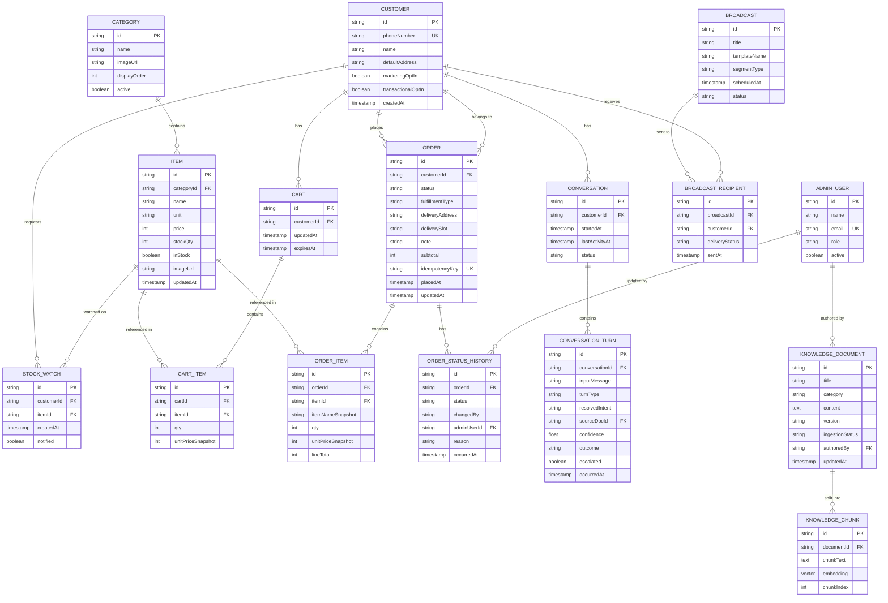

# WhatsApp Grocery Ordering System — Full ER Data Model

## 1. Entity-Relationship Diagram

---

## 2. Entity Details

### 2.1 `Customer`
| Field | Type | Notes |
|---|---|---|
| id | UUID (PK) | Internal ID |
| phoneNumber | string (unique) | WhatsApp `wa_id`, e.g. `919812345678` — natural external key, but keep an internal `id` too so nothing downstream depends on phone-number format |
| name | string | From WhatsApp profile or provided during first order |
| defaultAddress | string, nullable | For faster repeat checkout |
| marketingOptIn | boolean, default false | Governs FR17/FR29 — **must be explicit**, never defaulted true |
| transactionalOptIn | boolean, default true | Order-status notifications — separate flag from marketing per WhatsApp policy |
| createdAt | timestamp | |

### 2.2 `Category`
| Field | Type | Notes |
|---|---|---|
| id | UUID (PK) | |
| name | string | e.g. "Vegetables" |
| imageUrl | string | S3 URL |
| displayOrder | int | Controls list-message row ordering |
| active | boolean | Soft-hide instead of delete |

### 2.3 `Item`
| Field | Type | Notes |
|---|---|---|
| id | UUID (PK) | |
| categoryId | UUID (FK → Category) | |
| name | string | |
| unit | string | kg / pack / litre / piece |
| price | int (minor units) | Paise, not float |
| stockQty | int | |
| inStock | boolean | Denormalized flag for fast filtering, kept in sync with stockQty |
| imageUrl | string | S3 URL |
| updatedAt | timestamp | Drives `item.out_of_stock` event trigger on flip to false |

### 2.4 `Cart` / `CartItem`
- `Cart` is 1:1 with an active customer session (Redis-backed in practice; this table is the durable fallback/audit copy if you choose to persist carts, or can be Redis-only if you don't need cart history).
- `CartItem.unitPriceSnapshot` — capture price at add-time, not a live join to `Item.price`, so a mid-cart price change doesn't silently alter what the customer sees at checkout.

### 2.5 `Order` / `OrderItem` / `OrderStatusHistory`
| Field | Type | Notes |
|---|---|---|
| Order.status | enum | `PLACED, CONFIRMED, PACKING, PACKED, OUT_FOR_DELIVERY / READY_FOR_PICKUP, DELIVERED, CANCELLED` |
| Order.idempotencyKey | string (unique) | Enforces NFR1 at the DB level, not just application logic — a unique constraint here is the real guarantee |
| OrderItem.itemNameSnapshot, unitPriceSnapshot | string, int | Snapshot at order time — historical orders must not change if the catalog changes later |
| OrderStatusHistory.changedBy | enum | `CUSTOMER`, `ADMIN`, `AI`, `SYSTEM` — lets you audit exactly who/what triggered each transition (important once AI can also cancel orders) |
| OrderStatusHistory.adminUserId | FK, nullable | Populated only when `changedBy = ADMIN` |

### 2.6 `StockWatch`
- Backs the "notify me when back in stock" feature (Section 5 of the requirements doc). One row per customer-per-item; `notified` flag prevents duplicate alerts, cleared on notify.

### 2.7 `Conversation` / `ConversationTurn`
| Field | Type | Notes |
|---|---|---|
| Conversation.status | enum | `ACTIVE, IDLE, ESCALATED, CLOSED` |
| ConversationTurn.turnType | enum | `MENU_NAVIGATION, AI_INFORMATIONAL, AI_ACTIONABLE` |
| ConversationTurn.resolvedIntent | string, nullable | e.g. `CANCEL_ORDER`, `CHECK_STATUS` — null for menu-navigation turns |
| ConversationTurn.sourceDocId | FK → KnowledgeDocument, nullable | Populated only for RAG-answered turns — this is what makes an AI answer auditable (FR-AI3) |
| ConversationTurn.confidence | float, nullable | Drives the escalation threshold |
| ConversationTurn.escalated | boolean | Feeds the admin AI-review dashboard (FR31) |

### 2.8 `KnowledgeDocument` / `KnowledgeChunk`
- `KnowledgeDocument` is the admin-editable source (FR30); `KnowledgeChunk` is the derived, embedded representation used by pgvector for retrieval.
- `KnowledgeDocument.version` increments on every edit; re-ingestion regenerates all chunks for that document and marks `ingestionStatus = PENDING → COMPLETED`.
- `KnowledgeChunk.embedding` is a pgvector column (e.g., `vector(1536)` depending on the embedding model dimension).

### 2.9 `AdminUser`
| Field | Type | Notes |
|---|---|---|
| role | enum | `OWNER_ADMIN, STAFF` — maps directly to FR32 |

### 2.10 `Broadcast` / `BroadcastRecipient`
- `Broadcast.segmentType` — e.g. `OPTED_IN_ALL`, `OPTED_IN_BY_CATEGORY` (future segmentation per FR29).
- `BroadcastRecipient` is only ever populated from customers where `marketingOptIn = true` — enforce this at the query level, not just at send time, so an accidental broadcast can never reach a non-opted-in customer.

---

## 3. Key Relationships & Cardinalities

- One `Customer` → many `Order`s, one active `Cart`, many `Conversation`s.
- One `Category` → many `Item`s (no cross-category items — keep the model simple; use search/tags later if cross-listing becomes a need).
- One `Order` → many `OrderItem`s (snapshotted) and many `OrderStatusHistory` rows (append-only — never update or delete a history row, only insert).
- One `Conversation` → many `ConversationTurn`s (append-only, same audit principle).
- One `KnowledgeDocument` → many `KnowledgeChunk`s (1:N, regenerated wholesale on each edit).
- One `Broadcast` → many `BroadcastRecipient`s (join/fan-out table, one per targeted customer, tracks individual delivery status).

---

## 4. Indexing Notes

- `Customer.phoneNumber` — unique index (primary lookup path for every inbound webhook).
- `Order.idempotencyKey` — unique index (NFR1 enforcement).
- `Order.customerId, status` — composite index (powers both the admin order queue and "customer's active order" lookups).
- `Item.categoryId, inStock` — composite index (catalog browse is your highest-read path).
- `KnowledgeChunk.embedding` — pgvector HNSW or IVFFlat index for similarity search performance.
- `OrderStatusHistory.orderId, occurredAt` — for reconstructing a full order timeline in order.

---

## 5. Design Notes Worth Calling Out

- **Snapshotting price and item name into `OrderItem`** is deliberate, not an oversight — orders must remain historically accurate even after a catalog price change or item rename.
- **`changedBy` on `OrderStatusHistory` including `AI`** is what lets you later answer "did a human or the bot cancel this order?" — a real accountability question once the AI layer can act.
- **`KnowledgeChunk` separated from `KnowledgeDocument`** keeps RAG re-ingestion cheap and reversible — you can regenerate embeddings without touching the source-of-truth text, and you can swap embedding models later by re-chunking without losing the original documents.
- **Cart persistence is optional** — if you don't need cart history/analytics, keep `Cart`/`CartItem` Redis-only and drop the Postgres table; the ER model includes it here for completeness and in case you want cart-abandonment reporting later.

---

*Next natural step: OpenAPI/Swagger spec generation from the API contracts, wired against these entities — or a Liquibase/Flyway migration script scaffold to stand up this schema in Postgres. Let me know which to draft next.*
